#### 创建索引

mysql索引结构
- BTree 索引
- Hash索引
- full-text全文索引
- R-Tree索引

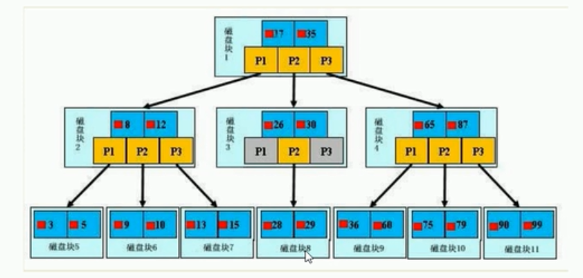
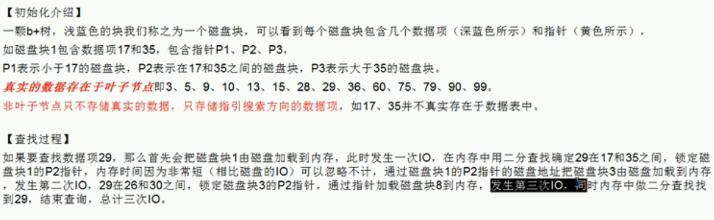

哪些情况需要索引哪些情况不能
- 主键字段建立唯一索引
- 频繁作为查询条件的自动应该创建索引
- 查询中与其他表关联的字段，外键关系建立索引
- 频繁更新的字段不适合创建索引 每次更新要更新索引树
- where 条件里用不到的字段不创建
- 单键/组合索引的选择 （高并发下倾向组合索引）
- 查询中排序的字段，排序字段若通过索引去访问将大大提高排序速度
- 查询中统计或者分组的字段 

那些情况不要建索引
- 表记录太少 300W
- 经常增删改
- 数据重复且分布平局的表字段 true false两种值类型？？？无效 表中数据/可选择性 =1效率最高 ep 2000条数据t/f 2/2000  没用

性能分析 EXPLAIN
- 能干啥？1 表达读取顺序[exp_ID说明一切]，2数据读取操作的操作类型[select_type]3那些索引可以使用，4那些索引被实际使用 5表之间的引用6每张表有多少行被优化器查询
-  id: 查询的序列号，包含一组数字，表示查询中执行select子句或操作表达顺序 1，id 相同，执行顺序从上向下先加载t1表在t3表后来t2表??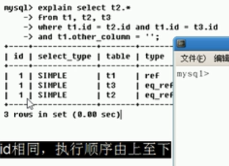 2 id 不同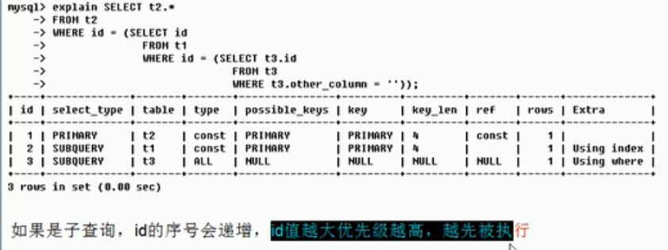2.3 id相同不同，同时存在 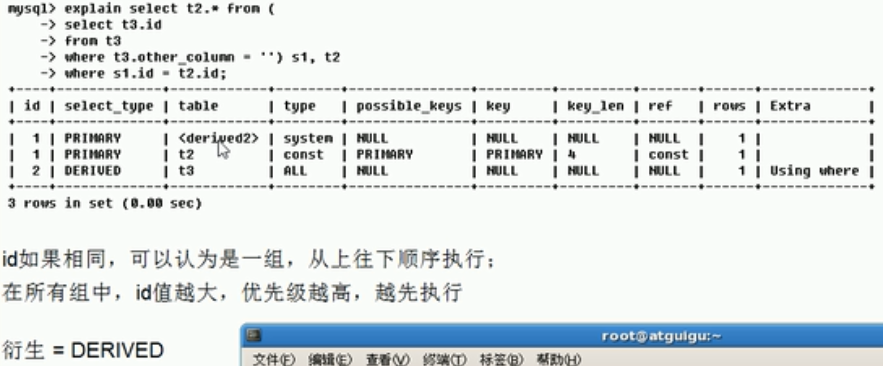 
-  select_type: 1-SIMPLE 2-PRIMARY 3-SUBQUERY 4-DERIVED 5-UNION 6-UNION RESULT;普通查询，联合查询，子查询等等复杂查询
primary 最外层 subquery子查询类型 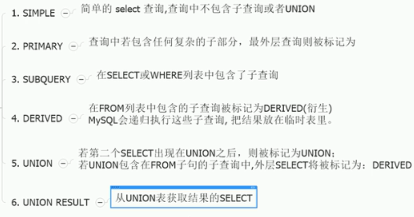 
-  table: 显示这一行当数据是关于那张表的
-  type: 1 all,2 index,3 range,4 ref,5 eq_ref,6 const,7 stystem,8 null 从最好到最差 system>const>eq_ref>ref>range>index>ALL 全部的是system>const>eq_ref>ref>fulltext>ref_or_null>index_merge>unique_subquery>index_subquery>range>index>ALL 至少达到range-ref ep:typesystemcount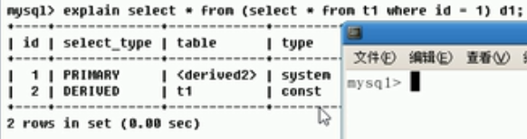 eq:typeeqref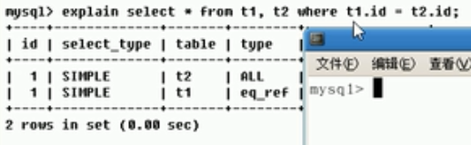 eq:typeref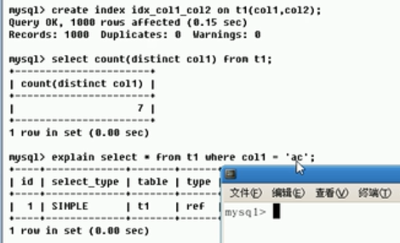eq:typerange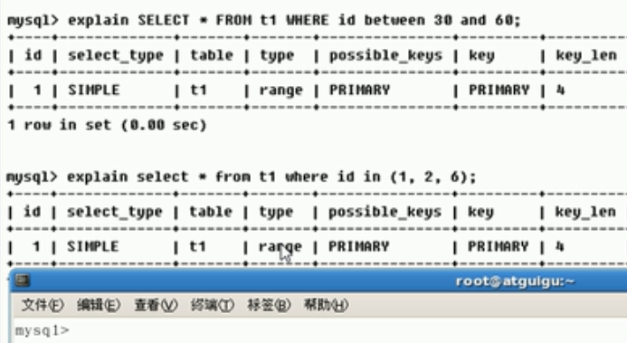eq:typeindex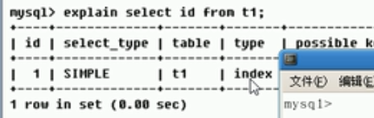 eq:typeall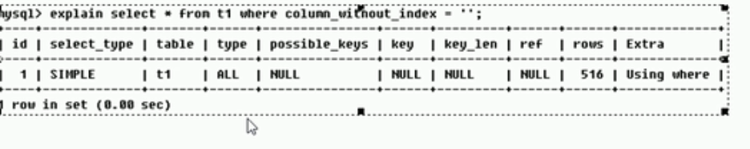
-  possible_keys: 显示可能应用在这张表中的索引，一个或多个；查询涉及到的字段上若存在索引，则该索引将被列出，但不一定被查询实际使用eq:epkey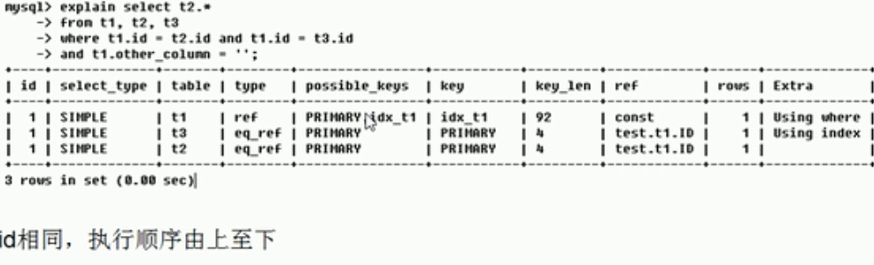
-  key: 实际使用的索引。如果为Null则没有使用索引，查询中使用了覆盖索引，则该索引仅出现在key列表中EXPLAIN SELECT * from user where email = 'dfs';eq:expkey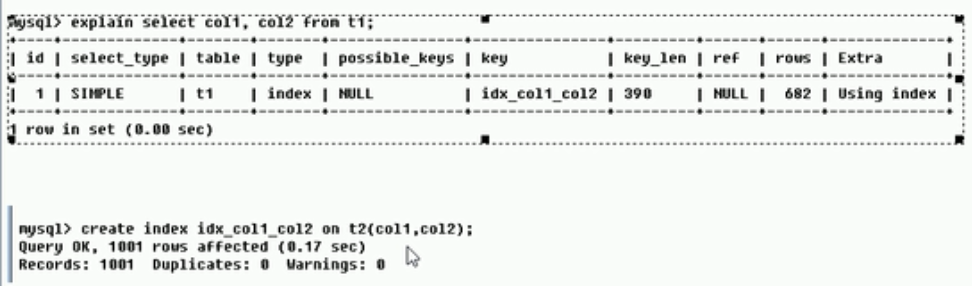 索引与列正好对应起来
-  key_len: 表示索引中使用的字节数可通过该列计算查询中使用的索引的长度。在不损失精度精确性的情况下，长度越短越好 key_len显示的值为索引字段的最大可能长度。￥并非实际使用长度￥即key_len是根据表定义计算而得，不是通过表内检索出的eq:keylen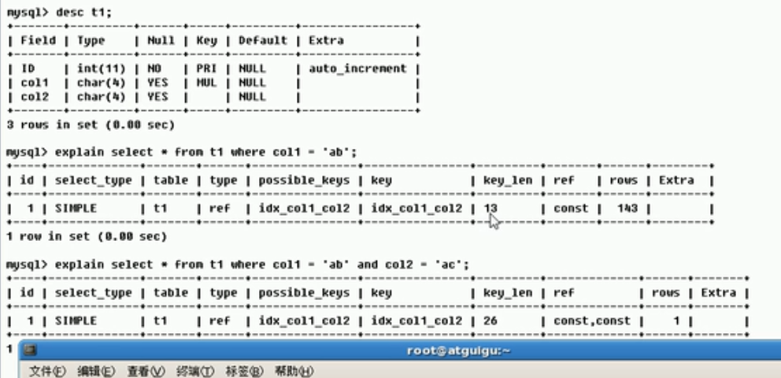
-  ref: 显示的索引的哪一列被使用了，如果可能的话，是一个常数，那些列或常量被用户查找索引列上的值eq:最后一个where otherC ='' 是一个常量exref 库.table.column 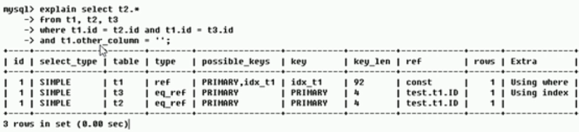 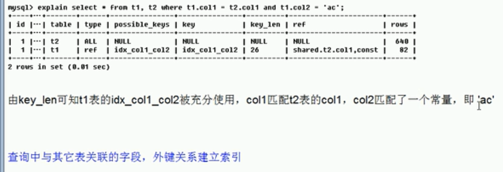
-  rows: 根据表统计信息及索引选用情况，大致估算出找到所需的记录所需要读取的行数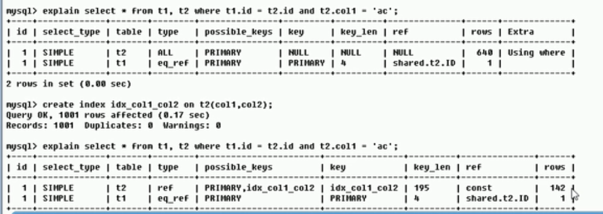
-  Extra: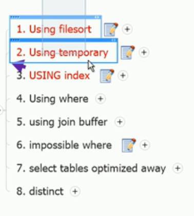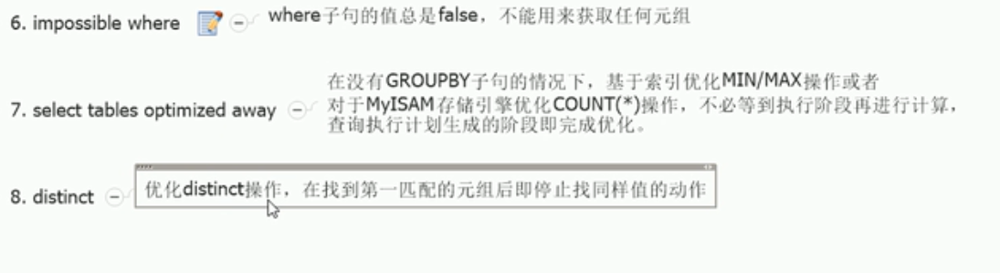包含不适合在其他列中显示，又十分重要的事情1 不好说明mysql会对数据使用一个外部的索引排序，而不是按照表内的索引顺序进行mysql无法利用索引完成排序的操作叫“文件排序”差usingfilesort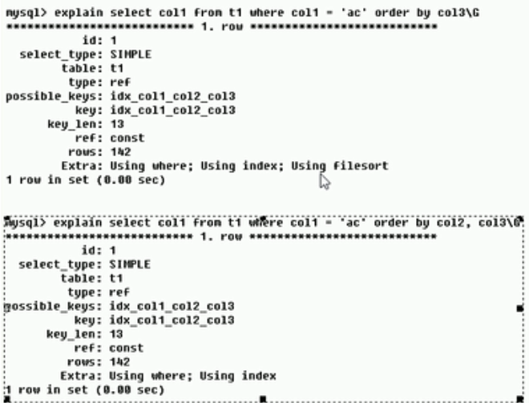2 using temporary 更差 产生了临时表保存中间结果mysql在对查询结果排序时使用临时表，常见于排序Orderby 和分组groupby 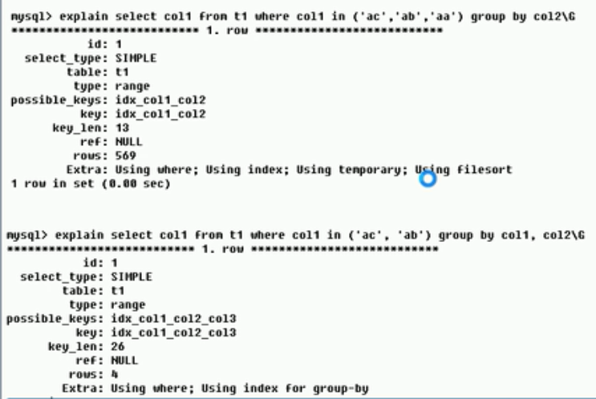 3 using index【覆盖索引covering index】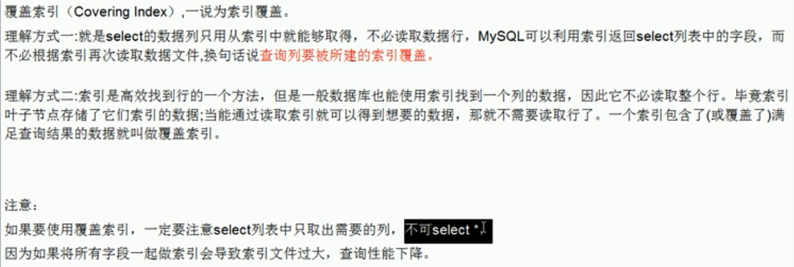 表示相应的select操作中使用了覆盖索引避免访问了表达数据行，如果同时出现usingwhere表明索引被用来执行索引键值的查找如果没有出现where表明索引用来读取数据而非执行查找动作 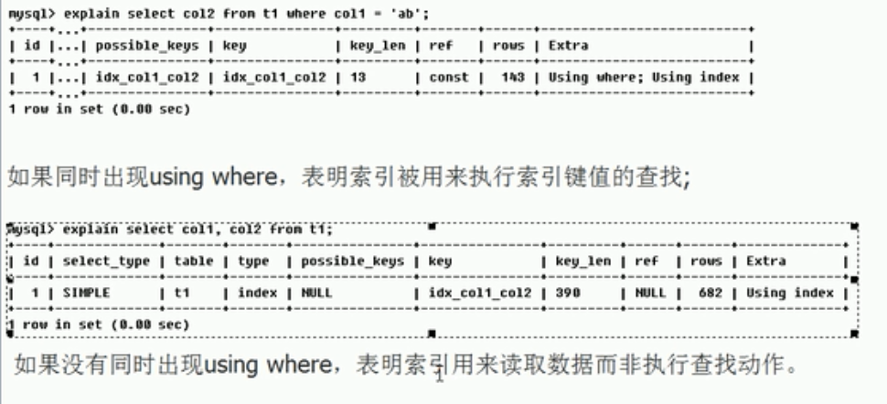

1 . 单值索引
- 即一个索引值包含单个列，一个表可以有多个单列索引一张表<5好
- select * from user where name =''
- create index idx_user_name on user(name)

2 . 唯一索引
- 索引列的值必须唯一，但允许空值

3 . 复合索引
- 一个索引包含多个列

基本语法
- 创建 - CREATE [UNIQUE] INDEX indexName ON mytable(columnname(length));+ ALTER mytable ADD [UNIQUE] INDEX [indexnAME] ON (columnname(length)) $ []可以省略 $
- 删除 - DROP INDEX [indexName] ON mytable;
- 查看 - SHOW INDEX FROM table_name\G 

使用ALTER命令 4种方式
- ALTER TABLE tb_name ADD PRIMARY KEY (column_list) 该语句添加一个主键，这意味着索引值必须是唯一的，且不能为null
- ALTER TABLE tb_name ADD UNIQUE index_name(column_list) 创建索引的值不许说唯一的 null除外
- ALTER TABLE tb_name ADD INDEX index_name(column_list) 添加普通索引，索引值可以出现多次
- ALTER TABLE tb_name ADD FULLTEXT index_name(column_list) 指定了索引为FULTEXT，用于全文索引

多值索引
- select * from user where name='' and email=''
- create index idx_user-nameEmail on user(name,email);

优势
- 提高数据检索效率，降低数据库IO成本
- 通过索引对数据进行排序，降低数据排序成本，降低CPU消耗

劣势
- 虽然索引达到提高查询速度，却会降低更新表达速度，如对表进行insert,update,delete因为表更新时，mysql不仅要保存数据，还要保存一下索引文件每次更新添加了索引列的字段，都会调整因为更新锁带来的键值变化后的索引信息
```		
SELECT DISTINCT <select_list>
FROM <left_table> <join_type>
JOIN <right_table> ON <join_condition>
WHERE <where_condition>
GROUP BY <group_by_list>
HAVING <having_condition> 
// group条件 id>300
ORDER BY <order_by_condition>
LIMIT <limit_number>

```

joins sql 7种方式 交集并集 ab图  
mysql没有outer join只能用union方式
```
SELECT
	*
FROM
	tbl_emp e
LEFT JOIN tbl_dept d ON e.deptId = d.id
UNION
SELECT
	*
FROM
	tbl_emp e
RIGHT JOIN tbl_dept d ON e.deptId = d.id
```
```
SELECT
	*
FROM
	tbl_emp e
LEFT JOIN tbl_dept d ON e.deptId = d.id where d.id IS NULL
UNION
SELECT
	*
FROM
	tbl_emp e
RIGHT JOIN tbl_dept d ON e.deptId = d.id where e.deptId IS NULL
```
索引单表优化案例
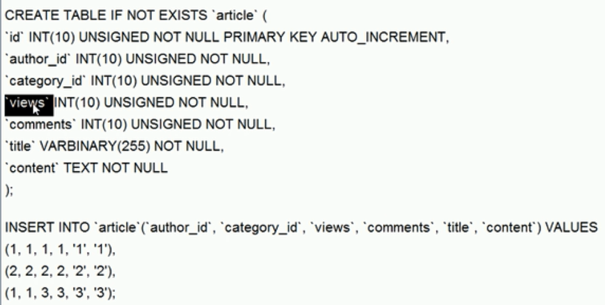

索引双表
- 左链接加右表， 又连左表